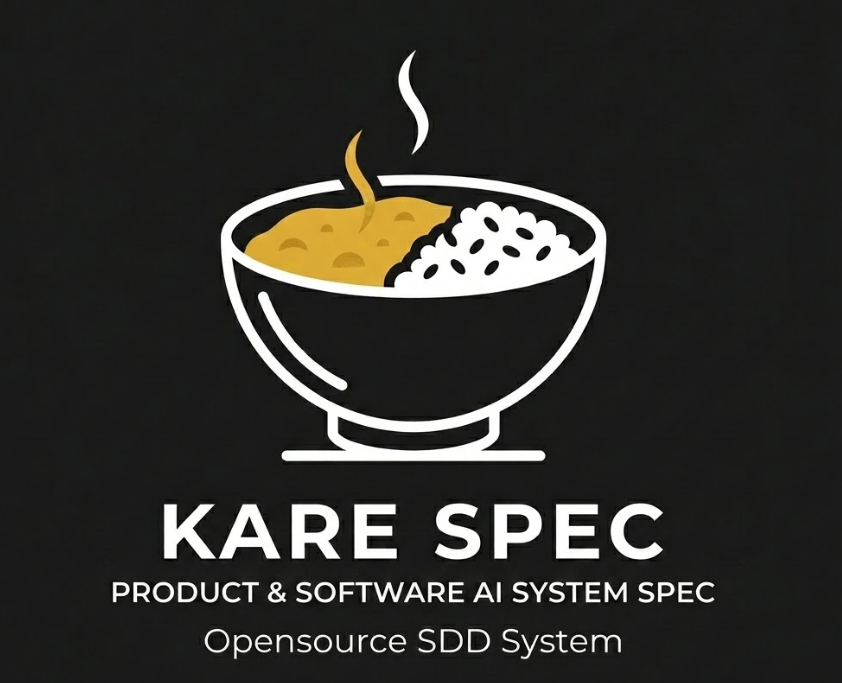

<div align="center">



# KARE-SPEC

**A plataforma de agentes de IA que leva um produto da ideia ao PR para produção, com configuração mínima e amigável.**

_Abra a pasta no VS Code. Pergunte "quem é você?". Pronto: o time de 27 agentes especializados já está ativo._

---

[](#agentes-especializados)
[](#slash-commands)
[](#skills)
[](#integração-mcp)
[](#)
[](#idioma)
[](#por-que-vs-code-configuração-mínima-e-amigável)
[](LICENSE)

</div>

---

> **Repositório:** `https://github.com/giovannyesposito/KARE-PSAISS-CORE`
> **Ambiente nativo:** VS Code + GitHub Copilot Chat
> **Também compatível com:** Claude Code, Gemini CLI, e qualquer IDE/agente que leia arquivos de instrução customizados (Cursor e afins)
> **Idioma de uso:** Português Brasileiro (PT-BR)
> **Versão:** v3.0.0

---

## Sumário

1. [Por que o KARE-SPEC existe](#por-que-o-kare-spec-existe)
2. [Comparativo: KARE-SPEC vs. Spec Kit vs. BMAD-METHOD](#comparativo-kare-spec-vs-spec-kit-vs-bmad-method)
3. [Por que VS Code: configuração mínima e amigável](#por-que-vs-code-configuração-mínima-e-amigável)
4. [Compatibilidade com IDEs e Agentes de IA](#compatibilidade-com-ides-e-agentes-de-ia)
5. [Ganhos por Perfil](#ganhos-por-perfil)
6. [O que é o KARE-SPEC](#o-que-é-o-kare-spec)
7. [Modelo de Operação](#modelo-de-operação)
8. [Arquitetura e Governança](#arquitetura-e-governança)
9. [Pré-requisitos](#pré-requisitos)
10. [Instalação e Onboarding](#instalação-e-onboarding)
11. [Configuração do Ambiente](#configuração-do-ambiente)
12. [Integração MCP](#integração-mcp)
13. [Como Usar](#como-usar)
14. [Slash Commands](#slash-commands)
15. [Agentes Especializados](#agentes-especializados)
16. [Skills](#skills)
17. [Segurança e Observabilidade](#segurança-e-observabilidade)
18. [Alinhamento Metodológico](#alinhamento-metodológico)
19. [Estrutura do Projeto](#estrutura-do-projeto)
20. [Organização de Artefatos](#organização-de-artefatos)
21. [Memória e Contexto (RAG)](#memória-e-contexto-rag)
22. [Gate de Qualidade e DoD](#gate-de-qualidade-e-dod)
23. [Idioma](#idioma)
24. [Licença e Marca](#licença-e-marca)
25. [Glossário](#glossário)

---

## Por que o KARE-SPEC existe

Times que adotam IA para desenvolvimento normalmente esbarram em três problemas, mesmo com boas ferramentas de "spec-driven development":

1. **A IA só entra depois que a ideia já virou spec técnica.** Descoberta de produto, PRD, priorização de backlog e mapeamento de risco continuam manuais, e a IA só ajuda a partir do meio do processo.
2. **Cada sessão começa do zero.** Sem memória persistente entre conversas, o time reexplica contexto de negócio, decisões arquiteturais e convenções toda vez.
3. **Configurar o ambiente para um agente de IA é, ironicamente, um projeto de engenharia.** Definir personas, regras, permissões de ferramentas: a maioria dos times não tem tempo para isso, e usuários não técnicos (PO, PM, analista de negócio) simplesmente não conseguem.

O KARE-SPEC ataca os três ao mesmo tempo: cobre **da ideia ao PR** (não só da spec ao código), mantém uma **base de conhecimento local persistente** entre sessões e projetos, e pede apenas **configuração mínima e amigável** ao abrir a pasta, sem exigir que o usuário entenda prompt engineering, YAML de agentes ou permissões de ferramentas.

---

## Comparativo: KARE-SPEC vs. Spec Kit vs. BMAD-METHOD

Três abordagens populares de desenvolvimento assistido por IA, e onde cada uma entrega mais valor. Comparação de escopo e arquitetura; refira-se sempre à documentação oficial de cada projeto para o estado mais atual delas.

| Capacidade | **KARE-SPEC** | GitHub Spec Kit | BMAD-METHOD |
|---|:---:|:---:|:---:|
| Discovery de produto (Brief, PRD, personas) | ✅ Camada Upstream dedicada | ❌ Fora de escopo (começa na spec) | ⚠️ Parcial (agente Analyst/PM) |
| Backlog estruturado SAFe (Epic→Capability→Feature→Story) | ✅ Nativo, com IDs rastreáveis | ❌ | ❌ |
| Análise de risco (RAID) e ADRs versionados | ✅ Agentes dedicados | ❌ | ⚠️ ADR-like via arquitetura, sem RAID |
| Fluxo Spec→Plan→Tasks→Implement | ✅ (`/speckit-*`, alinhado ao spec-kit) | ✅ Foco principal da ferramenta | ✅ Via story files |
| Memória persistente entre sessões (RAG local) | ✅ 3 bases SQLite + FTS5, sem servidor externo | ❌ | ❌ |
| Orquestração multi-agente (paralelo/sequencial/condicional) | ✅ 27 agentes, DAG de dependências | ❌ (agente único por vez) | ⚠️ Personas sequenciais, sem paralelismo nativo |
| Governança de agentes (permissões, loop detection, HITL gate) | ✅ Tool Guard, Loop Guard, Guardrail Gate | ❌ | ❌ |
| Integração nativa Jira/Confluence/Figma (MCP) | ✅ | ❌ | ❌ |
| Processos corporativos (CHG/GMUD, SPTI, status report) | ✅ Agente dedicado | ❌ | ❌ |
| Protocolo de aprovação prévia obrigatório | ✅ Inegociável, aplicado a todos os agentes | ⚠️ Depende do agente de IA usado | ⚠️ Depende do fluxo configurado |
| Setup em uma linha, com verificação de pré-requisitos | ✅ `setup.ps1`/`setup.sh` interativo e idempotente (Windows/Mac/Linux) | ✅ CLI própria (`specify init`) | ⚠️ Setup manual de agentes/expansion packs |
| Idioma dos artefatos | 🇧🇷 PT-BR nativo | 🇺🇸 Inglês | 🇺🇸 Inglês |

**Em resumo:** Spec Kit é excelente no que se propõe: a fatia spec→código. BMAD-METHOD é forte em roleplay de personas e fluxo de história. O KARE-SPEC assume as duas coisas como uma etapa (a camada Downstream, alinhada ao próprio modelo do spec-kit) e adiciona tudo que vem **antes** dela (descoberta, priorização, risco) e tudo que sustenta o uso **contínuo** (memória, governança, integrações corporativas).

---

## Por que VS Code: configuração mínima e amigável

O GitHub Copilot Chat lê dois pontos de extensão que o KARE-SPEC usa para se configurar sozinho, sem plugin nem instalação adicional. Estão declarados em [.vscode/settings.json](.vscode/settings.json):

```jsonc
"chat.promptFilesLocations": { ".agent/workflows": true },     // vira /create, /story, /implement...
"chat.instructionsFilesLocations": { ".agent/rules": true }    // carrega o protocolo KARE-SPEC em toda conversa
```

O efeito prático: no momento em que você abre a pasta no VS Code, os **52 slash commands** já aparecem no autocomplete do Copilot Chat, e as regras de comportamento (protocolo de aprovação prévia, padrão de pastas de output, idioma) já estão ativas, sem editar `settings.json`, sem copiar prompts, sem treinar o modelo. Não existe passo de "importar a persona": a persona é o próprio repositório.

Isso é o que sustenta a frase do topo deste README: **abrir a pasta e perguntar "quem é você?" já é o teste de fumaça completo da instalação.**

---

## Compatibilidade com IDEs e Agentes de IA

| Ambiente | Suporte | Como funciona |
|---|---|---|
| **VS Code + GitHub Copilot Chat** | ✅ Nativo (ambiente de referência) | `chat.promptFilesLocations` + `chat.instructionsFilesLocations` carregam tudo automaticamente (ver seção acima) |
| **Claude Code** | ✅ Nativo | Lê [CLAUDE.md](CLAUDE.md) na raiz, com as mesmas regras e agentes, sem duplicar configuração |
| **Gemini CLI** | ✅ Nativo | Lê [GEMINI.md](GEMINI.md) na raiz |
| **Cursor e outros editores com IA** | ⚠️ Compatível via mecanismo próprio do editor | Agentes e skills são Markdown puro em `.agent/`: qualquer IDE que suporte regras/instruções customizadas consegue apontar para essa pasta, mesmo sem um arquivo de integração dedicado ainda |

Não há vendor lock-in: os agentes, skills e workflows são arquivos `.md` com frontmatter simples, e não dependem de nenhuma API proprietária. Se seu editor de IA favorito ainda não tem um arquivo de entrada dedicado (como `CLAUDE.md` ou `GEMINI.md`), ele mesmo assim pode consumir `.agent/agents/`, `.agent/skills/` e `.agent/workflows/` diretamente.

---

## Ganhos por Perfil

| Perfil | O que o KARE-SPEC resolve para essa pessoa |
|---|---|
| **PO / PM / Analista de Negócio** | Vira Brief, PRD e backlog SAFe priorizado a partir de uma conversa, sem escrever Gherkin ou aprender SAFe na mão. Não precisa saber programar para operar o `/create`. |
| **Tech Lead / Arquiteto** | ADRs gerados e versionados a cada decisão relevante, RAID atualizado por sprint, e uma camada Downstream (spec→plan→tasks) que obriga formalização antes de qualquer código ser escrito. |
| **Dev** | `/implement` já chega com ACs, ADRs e tasks rastreadas: o código sai com testes (TDD) e rastreabilidade a story/AC embutida como comentário. |
| **QA / Test Engineer** | Test plans, arquivos `.feature` e coverage matrix gerados a partir dos mesmos ACs usados no desenvolvimento, sem gap de interpretação entre dev e QA. |
| **Gerente de Projetos TI / PMO** | Agente dedicado a SPTI, CHG/GMUD, Sprint Zero e status report executivo, cobrindo processos corporativos que a maioria das ferramentas de IA para código ignora. |
| **Qualquer pessoa, técnica ou não** | Não precisa saber o que é um "system prompt". `setup.ps1`/`setup.sh` verifica pré-requisitos, instala dependências e configura credenciais com um único comando interativo; o resto é conversa em português. |

---

## O que é o KARE-SPEC?

O **KARE-SPEC** (KARE-PSAISS-CORE) é uma plataforma modular de agentes de IA especializados para desenvolvimento de produtos e software em projetos complexos, do discovery à entrega em produção.

### O que o KARE-SPEC faz

- **Configuração mínima e amigável:** abrir a pasta no VS Code já ativa 27 agentes e 52 slash commands, sem passo manual de configuração de IDE
- **Camada RAG auto-contida:** 3 bases SQLite locais com conhecimento perene de negócio e histórico de decisões, sem servidor externo e sem reescrever contexto a cada sessão
- **Integração MCP:** Jira Datacenter (OAuth), Confluence e Figma
- **Protocolo de aprovação:** nenhum artefato é gerado sem apresentação prévia do plano e aprovação explícita do usuário
- Transforma ideias em **backlogs SAFe estruturados** com épicos, features e stories
- Cria **critérios de aceite em Gherkin** rastreáveis e auditáveis
- Gera **planos de sprint**, revisão de código, planos de teste e ADRs
- Mapeia **riscos e dependências** (RAID) antes que virem incidentes
- Produz **releases, runbooks e SLOs** com evidência de qualidade
- Mantém **memória persistente** com histórico de decisões e artefatos por projeto
- Governa o próprio uso de IA: permissões por agente, detecção de loop, bloqueio de credenciais em texto plano

### O que o KARE-SPEC não faz

- Não altera código existente sem aprovação explícita
- Não gera artefatos sem apresentar o plano e obter "de acordo" do usuário
- Não apaga nem sobrescreve arquivos do repositório sem autorização
- Não cria branches nem faz commits automaticamente
- Não expõe credenciais ou dados sensíveis em artefatos gerados

---

## Modelo de Operação

O KARE-SPEC opera em **duas camadas** complementares:

```
Ideia / Demanda
      ↓
┌─────────────────────────────────────────────────────┐
│                  CAMADA UPSTREAM                    │
│   Discovery → PRD → Backlog SAFe → RAID → ADRs      │
│   Output: _outputs/<slug>/outputs_upstream/         │
└─────────────────────────────────────────────────────┘
      ↓ (aprovação do usuário)
┌─────────────────────────────────────────────────────┐
│                 CAMADA DOWNSTREAM                   │
│   SDD: Specify → Plan → Tasks → Implement → Converge│
│   Output: _outputs/<slug>/outputs_downstream/       │
└─────────────────────────────────────────────────────┘
      ↓
    PR para Produção
```

### Protocolo de Aprovação Prévia (INEGOCIÁVEL)

Antes de gerar qualquer artefato, o `@kare-orchestrator` (persona **KARE-Orquestrator**) apresenta:
1. Lista de artefatos a serem gerados
2. Estrutura e seções de cada documento
3. Paths de destino
4. Prévia visual de fluxos e fatiamento (quando aplicável)

**Somente após aprovação explícita** a geração é iniciada. Essa regra vale para os 27 agentes, sem exceção.

---

## Arquitetura e Governança

O que faz o KARE-SPEC seguro para usar em contexto corporativo, não só em experimentos pessoais:

| Camada | Componente | Função |
|---|---|---|
| **Orquestração** | `@kare-orchestrator` | DAG de dependências entre agentes, fan-out/fan-in, resolução de conflitos de output |
| **Memória** | RAG local (3 bases SQLite/FTS5) | Conhecimento perene + histórico de artefatos + telemetria, sem servidor externo |
| **Permissões** | Tool Guard | Restringe quais ferramentas (Bash, Write, Edit...) cada agente pode usar |
| **Segurança de loop** | Loop Guard | Detecta repetição de ação (3 strikes) e força HITL antes de continuar |
| **Autorização de risco** | Guardrail Gate | Exige aprovação humana explícita para skills CRITICAL/HIGH (sandbox de código, criação de agentes, ingestão RAG) |
| **Segurança de dados** | SQL Guard | Bloqueia qualquer query que não seja `SELECT` |
| **Segurança de credenciais** | `kare_credentials.py` + hook de pre-commit | Credenciais Jira/Confluence e senha do RAG perene criptografadas com AES-256-GCM (chave fora do repositório); commit com credencial em texto plano é bloqueado automaticamente |
| **Confiança** | Confidence Scoring | Score mínimo 0.70 para o orchestrator prosseguir sem pedir clarificação |

---

## Pré-requisitos

| Requisito | Versão mínima | Finalidade |
|---|---|---|
| **VS Code** | 1.90+ | Editor principal |
| **GitHub Copilot Chat** | Assinatura ativa | Motor de IA dos agentes |
| **Python** | 3.10+ | Scripts de automação e RAG |
| **Git** | qualquer | Controle de versão local |

### Verificar instalações

```powershell
python --version
git --version
```

### Extensões VS Code recomendadas

- **GitHub Copilot**: obrigatório (`GitHub.copilot`)
- **GitHub Copilot Chat**: obrigatório (`GitHub.copilot-chat`)
- **Markdown All in One**: render e edição de artefatos
- **Python**: suporte aos scripts do KARE-SPEC

---

## Instalação e Onboarding

A instalação foi desenhada para **qualquer perfil**, técnico ou não: um único comando interativo cuida de pré-requisitos, dependências, segurança e credenciais.

### Caminho rápido: `npx`

Se você já tem Node.js instalado, o jeito mais rápido é o wizard interativo
via `npx` — pergunta o diretório de destino, quais IDEs configurar (VS Code,
Cursor, IntelliJ, Claude Code, Gemini CLI), instala tudo, e oferece
configurar credenciais Atlassian e abrir a IDE no final:

```bash
npx @dit-h/kare-spec install
```

Isso substitui os Passos 1-4 abaixo. Use o caminho manual (`git clone` +
`setup.ps1`/`setup.sh`) se preferir mais controle sobre cada etapa, ou se
não tiver Node.js disponível.

### Passo 1: Clonar o repositório

```powershell
git clone https://github.com/giovannyesposito/KARE-PSAISS-CORE.git
cd KARE-PSAISS-CORE
```

### Passo 2: Executar o setup

Windows:
```powershell
.\setup.ps1
```

Mac/Linux:
```bash
./setup.sh
```

O setup é interativo e **idempotente** (pode rodar de novo sem efeito colateral), igual nas duas plataformas. Em uma execução ele:
1. Verifica Python, Git, VS Code e extensões obrigatórias, avisando o que falta instalar
2. Instala as dependências Python (`requirements.txt`)
3. Instala o hook de pre-commit que bloqueia credenciais em texto plano
4. Oferece configurar as credenciais Jira/Confluence/RAG criptografadas (pode pular com `-SkipCredentials` / `--skip-credentials`)

```powershell
.\setup.ps1 -Quick             # só instala dependências, sem wizard de credenciais
.\setup.ps1 -SkipCredentials   # pula só a etapa de credenciais
```
```bash
./setup.sh --quick             # só instala dependências, sem wizard de credenciais
./setup.sh --skip-credentials  # pula só a etapa de credenciais
```

### Passo 3: Inicializar o Context Engine

```powershell
python .agent/scripts/ai/kare_rag.py migrate
```

### Passo 4: Abrir no VS Code

```powershell
code .
```

Os 27 agentes e 52 slash commands já carregam automaticamente ao abrir o workspace (ver [Por que VS Code](#por-que-vs-code-configuração-mínima-e-amigável)).

### Passo 5: Verificar a instalação

Abra o Copilot Chat e digite:
```
Quem é você?
```

Resposta esperada:
> 🤖 *Sou o KARE-Orquestrator, o agente de entrada da plataforma KARE-SPEC: sistema de IA para desenvolvimento de produtos e software complexos, da ideia ao PR para produção.*

---

## Configuração do Ambiente

### Credenciais (Jira, Confluence, Figma)

> ⚠️ **Nunca crie `.env` em texto plano com credenciais reais.** O KARE-SPEC
> armazena credenciais criptografadas (AES-256-GCM) via `kare_credentials.py`,
> com a chave fora do repositório (`%USERPROFILE%\kare.key`), e o arquivo
> `.config/.venv/*.env(.example)` versionado é só um TEMPLATE de referência,
> nunca o arquivo real com valores.

```powershell
powershell -ExecutionPolicy Bypass -File .agent\scripts\infra\configure_mcp_atlassian.ps1
```

Isso pede a URL/usuário/token uma vez, salva criptografado, e o
`start_mcp_atlassian.py` descriptografa em memória a cada ativação do MCP;
nada em texto plano toca o disco do repositório. Para conferir o status sem
expor os valores: `python .agent/scripts/infra/kare_credentials.py check`.

Se o MCP Atlassian for ativado sem credenciais configuradas, o próprio
`start_mcp_atlassian.py` interrompe a inicialização e mostra o comando acima.

### Senha da base RAG perene

A primeira escrita na base perene (`kare_rag.py ingest|bootstrap|import`) pede
uma palavra-passe. **Padrão de fábrica: `@Kar3Padr4o123`**, intencionalmente
pública (documentada aqui), não secreta. Para definir uma própria (fica
criptografada no mesmo cofre AES-256-GCM das credenciais Atlassian):

```powershell
python .agent\scripts\infra\kare_credentials.py setup-perene
```

O `@kare-orchestrator` pergunta automaticamente, logo após a primeira
inserção, se você quer trocar ou manter a senha padrão.

---

## Integração MCP

| MCP | Ferramentas | Status |
|---|---|---|
| **Atlassian** (Jira + Confluence) | Criar/atualizar issues, publicar páginas, pesquisar | ✅ Ativo |
| **Figma** | Consultar arquivos, geração de slides | ✅ Ativo |

### MCP Atlassian (Jira + Confluence)

```powershell
python -m pip install --user mcp-atlassian
.\.agent\scripts\infra\configure_mcp_atlassian.ps1
```

---

## Como Usar

### Início Rápido

```
/create minha nova feature de [descreva aqui]
```

O KARE-SPEC:
1. Apresenta o plano de execução (artefatos, estrutura, agentes)
2. Aguarda sua aprovação
3. Após "de acordo", executa: Classifica → Brief → PRD → Backlog → RAID
4. Salva em `_outputs/<slug>/outputs_upstream/`

### Fluxo Completo

```
/create [ideia]                       → Brief + PRD + backlog (upstream)
/clarificar [escopo]                  → Resolve ambiguidades
/story [descrição]                    → Stories + ACs Gherkin + DoR
/sprint --capacity 40                 → Plano de sprint
/speckit-specify --story US-001       → spec.md (downstream)
/plan --slug <slug>                   → plan.md
/speckit-tasks --slug <slug>          → tasks.md
/implement --tasks TASKS-<slug>.md    → Código + testes TDD
/speckit-converge --slug <slug>       → Valida implementação × spec
/review [PR/diff]                     → Code review com contexto
/test --story US-001                  → Test plan + feature files
/quality --story US-001               → Gate DoD
/release --version v1.0.0             → Release Notes + Runbook
```

### Fluxo E2E

```
/kare-flow [iniciativa]
```
Orquestra todo o ciclo: Canvas → PRD → Story Map → Backlog → ADRs → RAID

---

## Slash Commands

### Ciclo de Desenvolvimento

| Comando | O que faz |
|---|---|
| `/create [ideia]` | Discovery completo: Brief → PRD → Backlog → RAID |
| `/clarificar [escopo]` | Levanta ambiguidades, premissas e gaps |
| `/story [descrição]` | Story + ACs Gherkin + DoR checklist |
| `/analisar [escopo]` | Consistência e rastreabilidade entre artefatos |
| `/checklist [escopo]` | Checklist de prontidão, qualidade ou aceite |
| `/sprint --capacity N` | Plano de sprint com capacidade balanceada |
| `/speckit-specify --story US-XX` | SDD 1/5: formaliza spec.md a partir da story/PRD |
| `/plan --slug <slug>` | SDD 2/5: plano técnico (plan.md) a partir da spec |
| `/speckit-tasks --slug <slug>` | SDD 3/5: decompõe spec+plan em tasks.md |
| `/implement --tasks TASKS-<slug>.md` | SDD 4/5: código + testes TDD rastreável a tasks/ACs |
| `/speckit-converge --slug <slug>` | SDD 5/5: valida implementação × spec, fecha o ciclo |
| `/review [PR/diff]` | Code review com contexto de story e ADRs |
| `/test --story US-XX` | Test Plan + arquivos `.feature` + Coverage Matrix |
| `/quality --story US-XX` | Gate DoD: ✅ PASS / ⚠️ WARNING / ❌ BLOCKER |
| `/risk --sprint N` | RAID Log + Risk-Adjusted Backlog |
| `/decision [escolha]` | ADR ou RFC versionado |
| `/release --version vX.Y.Z` | Release Notes + Runbook + Smoke checklist |
| `/status` | Dashboard: backlog + DORA + riscos |
| `/observe --slo` | SLOs + Runbooks + DORA Metrics |
| `/orchestrate [tarefa]` | Coordenação multi-agente paralela |
| `/kare-flow [iniciativa]` | Fluxo E2E: PRD Review → Arquitetura → Story Map → Backlog → ADRs → RAID |
| `/publish-confluence --context [slug]` | Publica artefatos no Confluence |
| `/memory-refresh --context [slug]` | Reconcilia memória e contexto do projeto |
| `/contexto-rag --file <path> --context <slug>` | Ingesta arquivo externo no RAG |
| `/compress-session` | Comprime contexto mid-session |

### Segurança: Guardrail Gate

| Comando | O que faz |
|---|---|
| `/guardrail-check [skill]` | Verifica se a skill está autorizada |
| `/guardrail-approve <skill> "<motivo>"` | Autoriza execução de uma skill |
| `/guardrail-status [--detail]` | Dashboard de status das skills |
| `/guardrail-revoke <skill>` | Revoga autorização ativa |
| `/sql-guard "<query>"` | Valida query SQL (SELECT-only) |

---

## Agentes Especializados

### Agentes: Produto, Agilidade e Gestão TI

| Agente | Papel |
|---|---|
| `@kare-orchestrator` (persona: **KARE-Orquestrator**) | **Entrada padrão**: orquestra todos os demais |
| `@product-discovery` | Discovery de produto, Brief, PRD, personas |
| `@story-crafter` | Stories SAFe, ACs Gherkin, DoR, DoD |
| `@backlog-architect` | Backlog SAFe, WSJF/RICE/MoSCoW, sprint planning |
| `@code-author` | Implementação TDD rastreável a ACs |
| `@review-master` | Code review com contexto SAFe e ADRs |
| `@test-engineer` | Test plan, BDD/Gherkin, feature files, coverage |
| `@quality-guardian` | Gate DoD, validação de ACs e qualidade |
| `@risk-analyst` | RAID log, risk-adjusted backlog, mitigação |
| `@tech-decision-maker` | ADRs, RFCs, decisões de arquitetura |
| `@delivery-observer` | DORA metrics, SLOs, runbooks, release tracking |
| `@prd-reviewer` | Validação de consistência e qualidade de PRD |
| `@project-classifier` | Classificação Greenfield / Brownfield |

### Agentes Técnicos (Downstream)

| Agente | Papel |
|---|---|
| `@spec-writer` | Intermediário SDD: spec.md, plan.md, tasks.md antes de codificar |
| `@frontend-specialist` | UI/UX web, React/Next.js |
| `@backend-specialist` | APIs REST/GraphQL, Node.js |
| `@database-architect` | Schema design, SQL, Prisma |
| `@mobile-developer` | iOS, Android, React Native |
| `@devops-engineer` | CI/CD, Docker, GitHub Actions |
| `@security-auditor` | OWASP Top 10, compliance |
| `@qa-automation-engineer` | E2E automatizado, pipelines de qualidade |
| `@debugger` | Análise de causa raiz, debugging |
| `@performance-optimizer` | Core Web Vitals, profiling |
| `@documentation-writer` | README, manuais técnicos, docs de API |
| `@ux-designer` | Design de interfaces, protótipos |
| `@project-planner` | Planejamento, decomposição de work |

---

## Skills

72 módulos de conhecimento carregados sob demanda pelos agentes, organizados em `.agent/skills/`.

| Categoria | Exemplos |
|---|---|
| **Upstream** (`01-upstream/`) | `project-discovery`, `user-story-craft`, `backlog-management`, `risk-management`, `bcp-counting` |
| **Downstream** (`02-downstream/`) | `tdd-workflow`, `clean-code`, `test-artifact-generation`, `quality-gates`, `review-patterns` |
| **Arquitetura** (`03-architecture/`) | `architecture`, `adr-patterns`, `api-patterns`, `database-design` |
| **Governança** (`04-governance/`) | `jira-workspace-guide`, `jira-assistant`, `jira-portfolio` |
| **Tech Stack** (`05-tech-stack/`) | `azure-iac-engineer`, `gcp-analytics-agent`, `kafka-event-architect`, `mulesoft-developer`, `elastic-observability`, `harness-cicd-engineer`, `openapi-3scale-developer`, `salesforce-developer`, `servicenow-developer` |
| **Plataforma** (`06-platform/`) | `orchestration-patterns`, `parallel-agents`, `kare-operating-model`, `proactive-agent-protocol`, `rag-continual-learning`, `security-red-team` |

---

## Segurança e Observabilidade

### Guardrail Gate: Autorização HITL

```powershell
py .agent/scripts/guards/guardrail_gate.py status
py .agent/scripts/guards/guardrail_gate.py approve code-author-autogen "TDD US-42 sprint 6"
py .agent/scripts/guards/guardrail_gate.py revoke security-red-team
```

### SQL Guard

```powershell
py .agent/scripts/guards/sql_guard.py validate "SELECT * FROM issues WHERE sprint = 3"
```

### Pre-commit Hook

```powershell
powershell -ExecutionPolicy Bypass -File .agent/scripts/infra/install_hooks.ps1
```

---

## Alinhamento Metodológico

### SAFe 5: Hierarquia de Backlog

```
Iniciativa / Projeto
 └── Epic (EP-001)
      └── Feature (FEAT-001)
           ├── User Story (US-001)
           └── Enabler (EN-001)
```

### SDD: Spec-Driven Development (Downstream)

```
/speckit-specify → /plan → /speckit-tasks → /implement → /speckit-converge
```
> `/plan` e `/implement` mantêm o nome curto por compatibilidade: são, na prática, as etapas Plan e Implement do SDD (agente `@spec-writer` e `@code-author`/`@test-engineer`, respectivamente).

### BDD: Critérios de Aceite em Gherkin

```gherkin
Dado <contexto inicial>
Quando <ação do usuário ou sistema>
Então <resultado esperado>
```

---

## Estrutura do Projeto

```
KARE-PSAISS-CORE/
│
├── .agent/                         ← Núcleo do sistema KARE-SPEC
│   ├── rules/                      ← Regras de comportamento (always-on no Copilot Chat)
│   ├── agents/  (27 agentes)       ← Personas de IA especializadas
│   ├── skills/  (72 skills)        ← Módulos de conhecimento
│   ├── workflows/ (52 workflows)   ← Slash commands
│   ├── templates/                  ← Templates SAFe
│   └── scripts/                    ← Scripts de automação
│
├── .specify/                       ← Camada de persistência RAG
│   └── rag/
│       ├── kare_perene_rag.db      ← Conhecimento permanente (versionado)
│       ├── kare_history_rag.db     ← Artefatos de projeto (local, não versionado)
│       ├── kare_telemetry.db       ← Telemetria (local, não versionado)
│       └── seed/
│           └── kare-universal.json ← Seed para regenerar banco perene
│
├── .config/                        ← Configuração local (não commitar)
│   └── .venv/                      ← Credenciais de integração (criptografadas)
│
├── .vscode/                        ← Configuração mínima do VS Code + Copilot Chat
│
├── uploads/                        ← Documentos de entrada por projeto
│   └── <project-slug>/
│
├── _outputs/                       ← Saída oficial dos artefatos
│   └── <project-slug>/
│       ├── outputs_upstream/       ← PRD, Backlog, RAID, ADRs, Story Map
│       └── outputs_downstream/     ← SDD: specs, plans, tasks, convergence
│
├── CLAUDE.md                       ← Entrada nativa para Claude Code
├── GEMINI.md                       ← Entrada nativa para Gemini CLI
├── LICENSE                         ← MIT
├── NOTICE.md                       ← Termos de marca/nome do projeto
├── PRIVACY.md                      ← O que é coletado e como desativar
├── README.md
├── setup.ps1                       ← Onboarding em um comando (Windows)
└── setup.sh                        ← Onboarding em um comando (Mac/Linux)
```

---

## Organização de Artefatos

| Tipo | Localização | Padrão de Nome |
|---|---|---|
| PRD, Brief, Backlog, RAID | `outputs_upstream/` | `PRD-<slug>.md`, `BACKLOG-<slug>.md` |
| User Stories | `outputs_upstream/` | `US-001-<slug>.md` |
| ADRs | `outputs_upstream/` | `ADR-007-<titulo>.md` |
| Sprint Plans | `outputs_upstream/sprints/` | `SPRINT-3.md` |
| Test Plans | `outputs_upstream/testes/` | `TEST-PLAN-US-001.md` |
| SDD Specs | `outputs_downstream/specs/` | `SPEC-<slug>.md` |
| SDD Plans | `outputs_downstream/plans/` | `PLAN-<slug>.md` |
| SDD Tasks | `outputs_downstream/tasks/` | `TASKS-<slug>.md` |
| Convergence | `outputs_downstream/convergence/` | `CONVERGE-<slug>.md` |

---

## Memória e Contexto (RAG)

O Context Engine roda **100% local**, sem servidor: três bancos SQLite com busca full-text (FTS5), cada um com um propósito próprio.

| Base | Arquivo | Para que serve |
|---|---|---|
| **Perene** | `kare_perene_rag.db` | Dados do projeto que não sofrem drift: domínio de negócio, modelos operativos do projeto e sistemas da stack tecnológica do projeto. Conhecimento estável, reaproveitado em qualquer sessão. |
| **History** | `kare_history_rag.db` | Decisões, análises, geração de artefatos e projetos executados. É a base que faz o KARE-SPEC se adaptar de forma gradual ao seu ambiente e à sua forma de trabalho. |
| **Telemetry** | `kare_telemetry.db` | Métricas de uso do KARE-SPEC: índices de aferição de uso da solução (métricas de uso de IA por agente, sessão e período). |

Só `kare_perene_rag.db` é versionado no repositório (pequeno, genérico,
reproduzível a partir de `seed/kare-universal.json`). `kare_history_rag.db` e
`kare_telemetry.db` acumulam dado local de cada instalação e nunca são
commitados. Ver [PRIVACY.md](PRIVACY.md) para o que é coletado e como
desativar a telemetria (`KARE_TELEMETRY_DISABLED=1`).

Visualização opcional em grafo via Neo4j.

```powershell
# Buscar contexto antes de gerar artefatos
python .agent/scripts/ai/kare_rag.py search "termos da demanda" --limit 5

# Ingerir artefato após criá-lo
python .agent/scripts/ai/kare_rag.py history ingest --title "..." --type prd --domains "projeto" --file <caminho>

# Verificar status dos bancos RAG
python .agent/scripts/ai/kare_rag.py status
```

### Tasks VS Code disponíveis

| Task | O que faz |
|---|---|
| `KARE: Bootstrap Context Engine` | Inicializa bancos RAG |
| `KARE: Migrate RAG` | Reprocessa seed e reindexar bancos |
| `KARE: Status` | Exibe contagem de nós por banco |

---

## Gate de Qualidade e DoD

| Status | Ação |
|---|---|
| ✅ PASS | Pode avançar |
| ⚠️ WARNING | Avançar com ciência do risco registrada |
| ❌ BLOCKER | **Não pode avançar** |

---

## Idioma

| Elemento | Idioma |
|---|---|
| Respostas dos agentes | **Português Brasileiro (PT-BR)** |
| Artefatos (backlog, PRD, ADR, testes...) | **Português Brasileiro (PT-BR)** |
| Código-fonte | **Inglês** |
| Gherkin | **Português** (Dado/Quando/Então) |

---

## Licença e Marca

O código é licenciado sob [MIT](LICENSE): use, modifique e redistribua
livremente, inclusive comercialmente. O nome "KARE-SPEC" / "KARE-Orquestrator"
e o logo são a identidade do projeto e têm termos próprios, separados da
licença de código: ver [NOTICE.md](NOTICE.md).

---

## Glossário

| Termo | Significado |
|---|---|
| **AC** | Acceptance Criteria: Critérios de aceite |
| **ADR** | Architecture Decision Record |
| **BDD** | Behavior-Driven Development |
| **DoD** | Definition of Done |
| **DoR** | Definition of Ready |
| **DORA** | 4 métricas de entrega: frequência de deploy, lead time, CFR, MTTR |
| **Epic** | Unidade SAFe estratégica |
| **Feature** | Principal item planejável do ART Backlog |
| **Gherkin** | Linguagem de ACs: Dado/Quando/Então |
| **HITL** | Human-in-the-Loop: aprovação humana obrigatória em pontos críticos |
| **MCP** | Model Context Protocol: Integração com ferramentas externas |
| **PRD** | Product Requirements Document |
| **RAID** | Risks, Assumptions, Issues, Dependencies |
| **RAG** | Retrieval-Augmented Generation: Busca semântica em artefatos |
| **SAFe** | Scaled Agile Framework |
| **SDD** | Spec-Driven Development |
| **Slug** | Identificador curto em kebab-case de um projeto |
| **SPTI** | Solicitação de Projeto de Tecnologia da Informação |
| **TDD** | Test-Driven Development |
| **WSJF** | Weighted Shortest Job First: Priorização SAFe |

---

<div align="center">


**KARE-SPEC (KARE-PSAISS-CORE)**
_Da ideia ao PR para produção, com configuração mínima e amigável._

</div>
